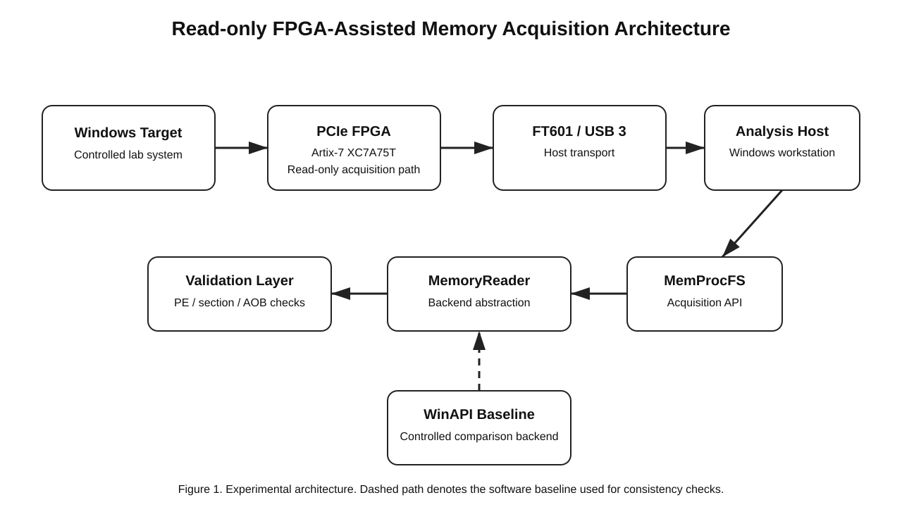
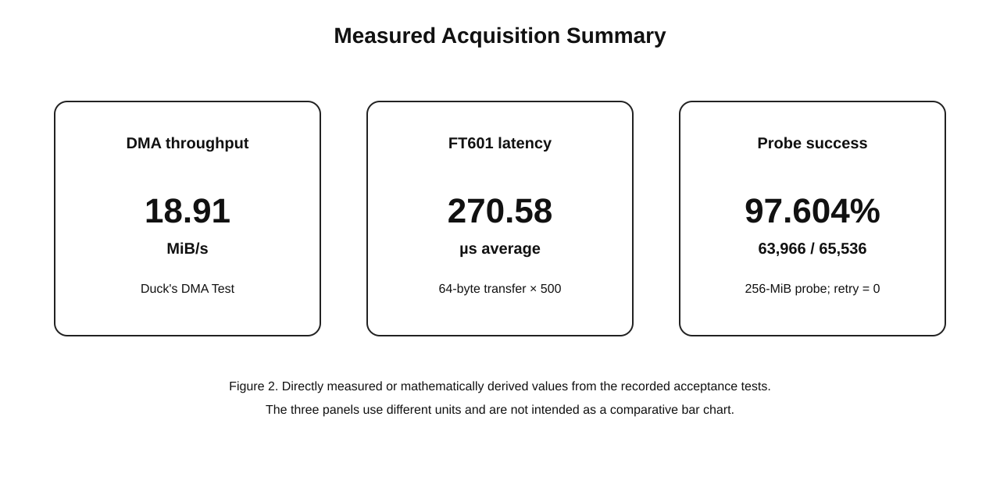

# Reliability Evaluation of FPGA-Assisted External Memory Acquisition for Security Research

**Status:** Unpublished technical report / preprint  
**Peer review:** Not peer reviewed  
**Date:** 2026-08-28  
**Author:** Rangesa

## Abstract

This report evaluates a read-only FPGA-assisted external memory-acquisition setup in a controlled Windows laboratory environment. The prototype uses an Artix-7 FPGA and FT601 transport together with a memory-analysis stack and a common abstraction for hardware-assisted and WinAPI-based reads. Direct command-output evidence preserved from the supplied rollout records shows a successful 256-byte physical-memory read, a 4-KiB transaction sequence containing 32 MRd32 requests and 32 matching CplD completions, a bounded 0–256 MiB probe with 63,966 pages read out of 65,536, and a WinAPI/MemProcFS DMA backend acceptance run with matching process, module, PE, section, and pattern results.



## 1. Scope and Research Question

The purpose of this work is to determine whether external, FPGA-assisted memory acquisition can be made sufficiently reproducible for controlled reverse-engineering, memory-forensics, and vulnerability-research experiments.

The implementation described here is intentionally read-only. Memory writing, code injection, process patching, persistence, and automated exploitation are outside the scope of this report.

## 2. Experimental Architecture

The acquisition pipeline consists of a Windows target system, a PCIe-attached Artix-7 FPGA, an FT601-based USB transport path, and a separate analysis host. On the software side, the external acquisition path is exposed through MemProcFS-compatible tooling and a common `MemoryReader` abstraction. A WinAPI backend is retained as a controlled baseline for consistency checks.

## 3. Evidence Method

The supplied Codex rollout JSONL was inspected for command-execution records rather than relying on assistant summaries. Direct stdout was recovered for:

1. a 256-byte PCILeech physical-memory display;
2. a 4-KiB TLP-level read test;
3. a bounded 0–256 MiB PCILeech probe;
4. a WinAPI/MemProcFS DMA backend comparison;
5. a Release x64 build and unit-test run.

A sanitized evidence extract, source event timestamps, and source-file SHA-256 are stored in [`evidence/2026-08-27-acceptance.md`](evidence/2026-08-27-acceptance.md).

## 4. Rollout-Backed Measurements

| Measurement | Result | Evidence status |
|---|---:|---|
| 256-byte physical-memory read | **PASS** | Direct command stdout |
| 4-KiB TLP requests | **32 MRd32** | Counted from direct command stdout |
| 4-KiB TLP completions | **32 CplD** | Counted from direct command stdout |
| TLP tag sequence | **01–20 matched** | Deterministic comparison of stdout |
| 0–256 MiB probe | **63,966 / 65,536 pages read** | Direct command stdout |
| Probe failures / UR | **1,570** | Direct command stdout |
| Probe retries | **0** | Direct command stdout |
| Exhausted reads | **0** | Direct command stdout |
| Protocol failures | **0** | Direct command stdout |
| Derived page-read rate | **97.604%** | Computed from direct counts |
| WinAPI / DMA backend acceptance | **PASS** | Direct command stdout |
| ReaderUnitTests | **PASS** | Direct command stdout |
| Release x64 build | **PASS** | Exit code 0 |



The machine-readable provenance table is stored in [`data/measurements.csv`](data/measurements.csv).

## 5. Acceptance Results

### 5.1 256-byte read

The recorded PCILeech command returned `EXIT=0` and printed memory contents for physical address `0x1000`. This establishes that the acquisition path returned actual memory bytes for the bounded read in that run.

### 5.2 4-KiB transaction sequence

The recorded TLP output contains 32 `MRd32` requests and 32 `CplD` completions. Request and completion tag sequences both run from hexadecimal `01` through `20` in the same order.

This result is stronger than a high-level “PASS” flag because it preserves the transaction-level request/completion relationship.

### 5.3 Bounded memory probe

The final probe output records:

```text
Pages read:     63966 / 65536
Pages failed:   1570
FPGA read outcomes [first_failed=1570, ur=1570, ca=0, retry=0, recovered=0, exhausted=0, protocol=0]
```

The derived page-read fraction is **97.604%**. This fraction should not be interpreted as a transport bit-error rate: failed pages can reflect addressability or target-memory mapping behavior.

### 5.4 Backend consistency

A later acceptance run reported identical WinAPI and MemProcFS DMA values for:

- PID;
- module name, base, and size;
- DOS and PE64 validation;
- scatter-read validation;
- executable-section count;
- `.text` RVA and size;
- pattern RVA;
- pattern readback.

Both paths returned `RESULT=PASS`, followed by `backend_acceptance: PASS`.

## 6. Engineering Finding: Offline Initialization

Earlier backend attempts stalled or failed during VMM initialization. The tested implementation subsequently added:

- `-disable-symbolserver`
- `-disable-symbols`
- `-disable-python`

After this change, the recorded acceptance run completed successfully. This illustrates why acquisition transport and optional analysis-framework initialization dependencies should be tested separately.

## 7. Additional Project Measurements Not Yet Rollout-Backed

Earlier project records contain the following values:

- `18.91 MiB/s` DMA throughput;
- `270.58 µs` average latency for 64-byte FT601 transfers across 500 iterations.

Exact matching raw lines for those values were not found in the five rollout files supplied on 2026-08-28. They are therefore retained as **pending-source measurements**, not used as direct evidence in the abstract or primary results.

## 8. Limitations

This report has several limitations:

- the evidence set represents a small number of acceptance runs rather than a statistical benchmark campaign;
- testing was performed on one hardware/software configuration;
- the source rollouts are preserved privately and only sanitized extracts are published;
- no independent replication has been performed;
- no claim of peer review, academic publication, CVE assignment, or DOI is made.

## 9. Reproducibility and Provenance

The repository publishes SHA-256 hashes for the five supplied rollout files in [`evidence/source-rollouts.sha256`](evidence/source-rollouts.sha256). This allows a holder of the source files to verify that an evidence extraction refers to the same underlying rollouts.

Future revisions should add the original standalone throughput and FT601 benchmark outputs, plus repeated runs with mean, median, standard deviation, and percentile latency.

## 10. Security and Responsible Use

External memory acquisition is dual-use. The same low-level access techniques can support digital forensics, incident response, malware analysis, reverse engineering, and vulnerability research, but can also be misused.

This report documents a controlled, read-only research configuration and does not present memory modification, injection, persistence, or exploitation as experimental objectives.

## 11. Conclusion

The preserved command outputs support the feasibility of a read-only FPGA-assisted memory-acquisition workflow in the tested environment. The strongest evidence is the combination of a successful bounded memory read, transaction-level 4-KiB request/completion matching, a completed 0–256 MiB probe with zero recorded retries/exhaustion/protocol failures, and a successful WinAPI-versus-MemProcFS backend consistency test.

The project should be considered an unpublished technical report with practical reproducibility evidence, not an independently reviewed academic result.

## References

1. Ulf Frisk, **MemProcFS**, GitHub: https://github.com/ufrisk/MemProcFS
2. Ulf Frisk, **PCILeech FPGA**, GitHub: https://github.com/ufrisk/pcileech-fpga

---

**Publication status:** Unpublished technical report / preprint  
**Peer-review status:** Not peer reviewed
